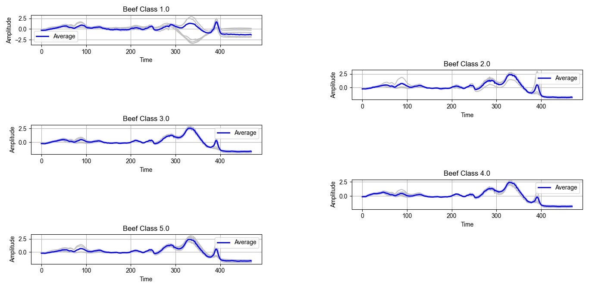
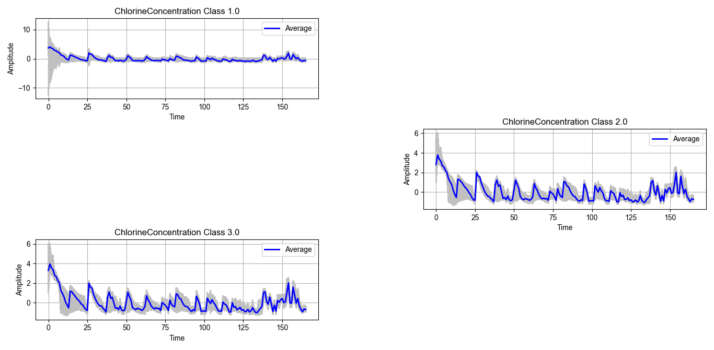
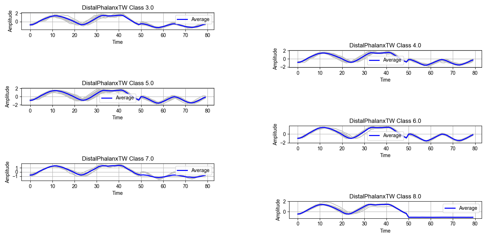
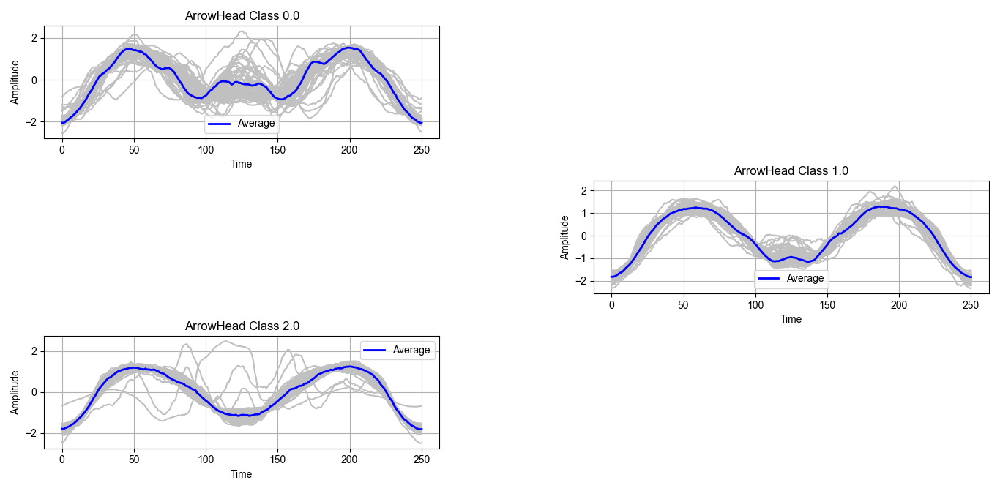
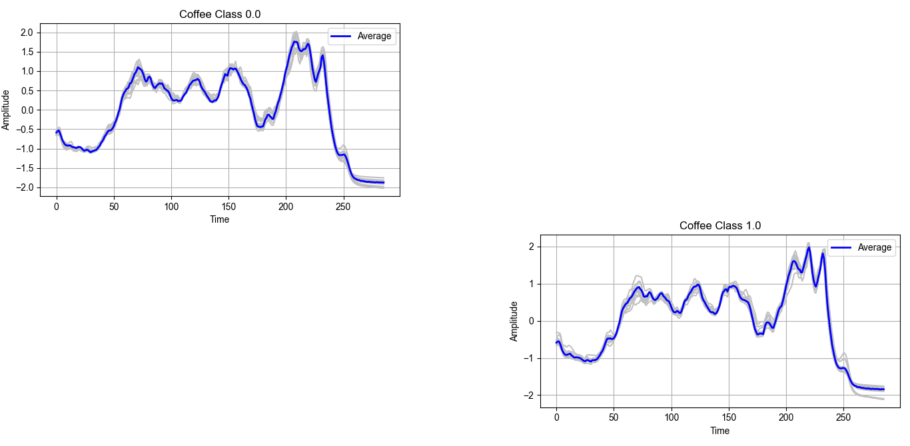
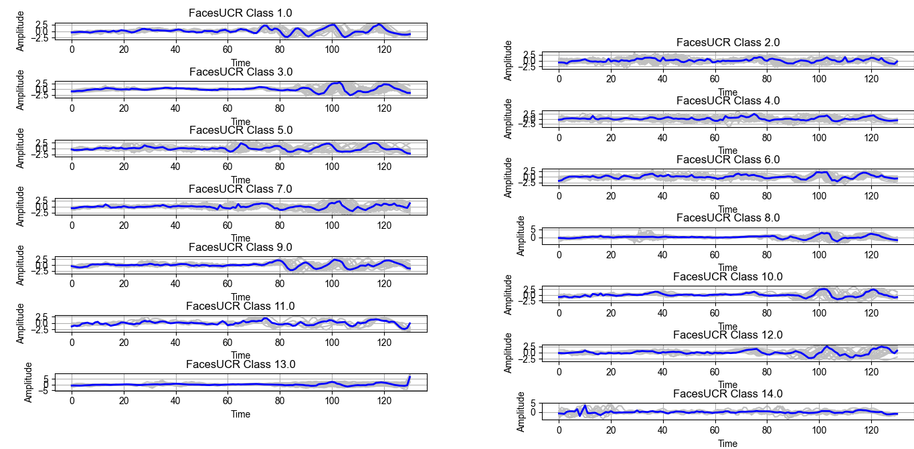

# TEstimating Time Series Averages from Latent Space of Multi-tasking Neural Networks.

# Description:

In this page, we present some examples demonstrating means estimated by our proposed approaches. To estimate the means, we used the train split of the UCR archive. However, in the plots, the time series ploted using silver colour are extracted from the test split. Moreover, the time seires in blue indicates the averages estimated from the training split. 
  
# The UCR CBF Dataset: Number of classes 3

# The UCR Beef Dataset: Number of Classes 5

# The UCR ChlorineConcentration Dataset: Number of Classes 3

# The UCR DistalPhalanxTW Dataset: Number of Classes 6

  
# The UCR ArrowHead Dataset: Number of Classes 3

# The UCR Coffee Dataset: Number of Classes 2

# The UCR FacesUCR Dataset: Number of Classes 14

# Research Funding:  

This research was conducted under the Ethio-France PhD. Program which is financed by:

<ol>  
<li>The former Ethiopian Ministery of Science and Higher Education (MOSHE)</li>
<li>The French Embassy to Ethiopia and African Union.</li>
</ol>  

  
We would like to acknowledge both parties for their generous contributions. 

