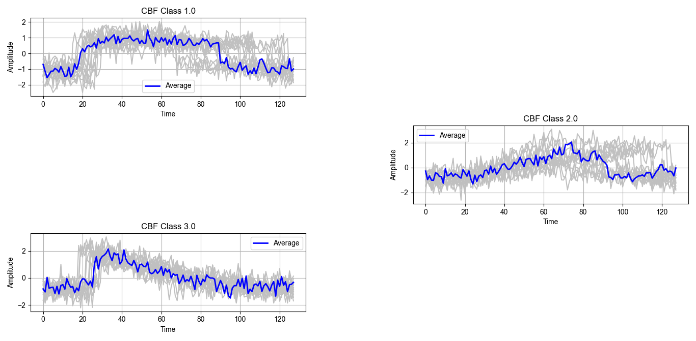

# TEstimating Time Series Averages from Latent Space of Multi-tasking Neural Networks.

# Description:

In this page, we present some examples demonstrating means estimated by our proposed approaches. To estimate the means, we used the train split of the UCR archive. However, in the plots, the time series ploted using silver colour are extracted from the test split. Moreover, the time seires in blue indicates the averages estimated from the training split. 
  
# The UCR CBF Ddataset: Number of classes 3

# Proposed Archtecture: 

# Demonstration of Results:

# How to Use the Scripts:

We have provided two versions of our implemenation. If the scripts are to be run on a server whith graphical displays diabled (if displaying plots is not possible), for instance on Google Colab; scripts within the "Without_Latent_Projection" folder can be used. On the contrary, if displaying plots is possible, scripts wihint the "With_Latent_Projection" folder can be used. Before executing the scripts download the univariate time series data sets from the Unversity of California Univariate Time sereis Repository (UCR), whcih can be found at https://www.cs.ucr.edu/%7Eeamonn/time_series_data_2018/UCRArchive_2018.zip. After the extraction of the data sets follow the below steps.

* open the "Conv_configuration.py" 
* Modify "self.File_loc" variable with the location of the UCR data sets. I.e., if location is XXX, then self.File_loc='XXXX/'
* Modify "self.Model_save_path" with a location that is persumed to be suitable to save data generated while training the network. I.e., if prefered location is XXX, then self.Model_save_path='XXX/'
* Within the folders of the scripts there is a "Dataset_List.csv" file; modify "self.List_of_data_sets" variable in the "Conv_configuration.py" script with the location of the "Dataset_List.csv" file. I.e., if the location of "Dataset_List.csv" is XXX, then self.List_of_data_sets='XXX/'
* Use the "Conv_autoencoder_main.py" to procede with network training.

We have set the main file to execute network training for five different L2 regularization setups as stated in the paper. If training the network for such iteration is not possible for different reason; then, the training can be executed for a single iteration by changing "self.iterations" variable in "Conv_configuration.py" to one. To furhter modify hyperparameters please refer to the comments in the "Conv_configuration.py" script.

# Research Funding:  

This research was conducted under the Ethio-France PhD. Program which is financed by:

<ol>  
<li>The Ethiopian Ministery of Science and Higher Education (MOSHE)</li>
<li>The French Embassy to Ethiopia and African Union.</li>
</ol>  

  
We would like to acknowledge both parties for their generous contributions. 

